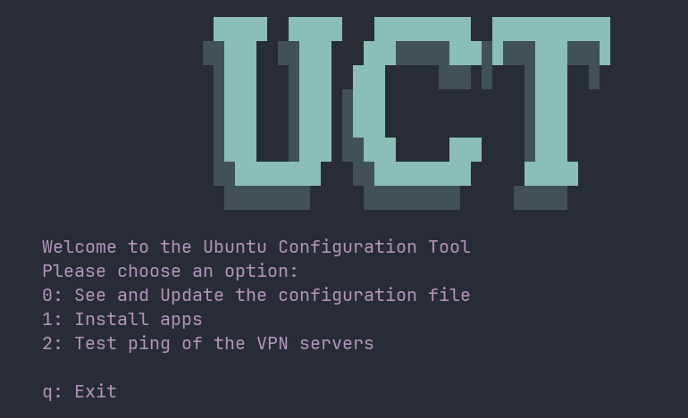

# Ubuntu-Config-Template

[]
A simple Ubuntu template for automating the installations of the necessary packages and apps.

As python3 comes out-of-the-box with Ubuntu, for starting this project you only need to use Python whether you are in a virtual environment or not.
try it with `python main.py` in a v. env or `python3 main.py` globally.

hope it suits your needs. Also, contributions are most welcome.
